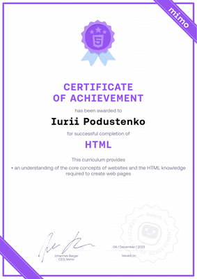

# Iurii Podustenko

## Contacts

- **Telegram:** [Yury785](https://t.me/Yury785)
- **Discord:** [metamorfoza007](https://discord.com/users/220167149979697153)
- **Github:** [Metamorfoza42](https://github.com/Metamorfoza42/)
- **E-mail:** yuriy.p142@gmail.com

## About me

My goal is to change my career path. I have master's degree in mechanical engineering, I used to design metal parts of mobile electric powerplants and slurry pumps for the mining industry, but I've lost interest in this profession after 5 years of work.
Now I'm thrilled to jump into front-end development to acquire related skills.

## Skills

- HTML
- CSS
- JavaScript
- Git
- VS Code

## Code Example

```javascript
let str = "TellMeHowLong";
let res = str.charAt(str.length - 1);
console.log(res);
```

## Education

- HTML course on [Mimo](https://mimo.org/) app

  

- St. Petersburg Polytechnic University, Mechatronics and Robotics master's degree

## English Language

**C1** - completed St. Petersburg city courses in 2017, had a lot of english speaking club practice, helped a friend prepare for the EPAM English exam for a B2+ grade
